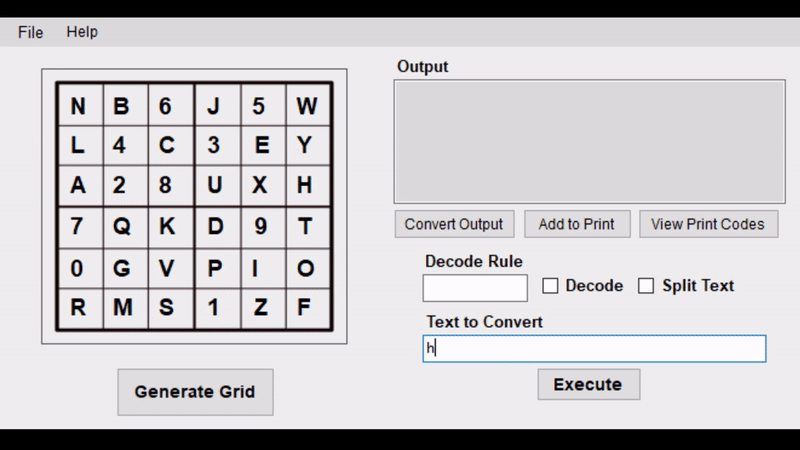

# BletchleyMaker

A personal project aimed at RAFAC (RAF Air Cadet) code-breaking exercises. The purpose of this tool is to encode sentences and create decode grids for the Air Cadet Bletchley Park cipher. This automates the process of making codes for Air Cadet activities.

## Features Available
- Encoding plaintext sentences into Bletchley Park ciphertext
- Generating a randomised decryption table (6x6 A-Z 0-9)
- Decoding input ciphertext
- Saving, opening and printing grids (Printing ONLY works in A4)

## Tool Use
To install the application, download the MSI file [here](https://github.com/shr0m/BletchleyMaker/releases/tag/v2.1.0.1).

### Basic guide:
- Generate: Generates a new random 6x6 grid including letters A-Z and 0-9
- Execute: Takes string from 'Text to Convert' and applies the reverse of the decode rule to encode
- Decode: If checked, will decode string from 'Text to Convert' with the decode rule as entered
- Split Text: Will split the output into groups of 5 to align with cipher rules
- Convert Output: Will copy text from output into 'Text to Convert'
- Add to Print: Will add the code in Output to print with the grid
- View Print Codes: Will show the list of codes which are saved to print with the grid (maximum 10). You may clear the print save or remove elements should you wish
- Menu: Provides additional functionality, such as printing, reporting errors, and creating own grids

## License
See [LICENSE](./LICENSE) for information regarding license(s)

## Support
Any issues can be reported in the issues tab of this repository. However, the developer may also be contacted through: jan.korzybski@proton.me
Requests can be made for other features and updates.

## About RAFAC
The [Royal Air Force Air Cadets](https://www.raf.mod.uk/aircadets/) is the combined volunteer-military youth organisation sponsored by the Royal Air Force, which is formed by both the Air Training Corps and RAF Sections of the Combined Cadet Force. The organisation is headed by a former serving RAF officer, Commandant Air Cadets.
